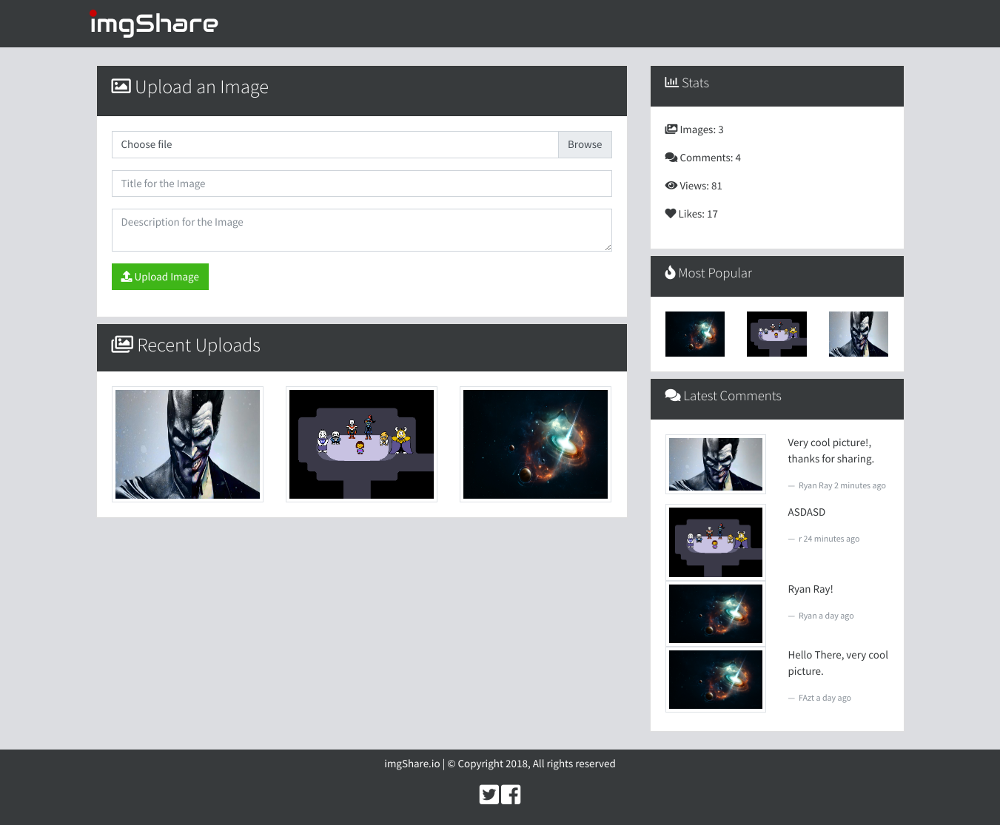

# imgShare
imgShare is a web application to share images, comments, and more.



# Environment Variables
* `MONGODB_URI`, the mongodb database uri
* `PORT` the http server port. By default is `3000`

# Installation
```
git clone https://github.com/FaztTech/nodejs-imgshare
cd nodejs-imagshare
npm install 
npm start
```

# Docker
```
docker-compose build
```
```
docker-compose up
```

# Tutorials
* [Youtube (es)](https://youtu.be/TqC3e8nBycg)

# Improvements for the Future
- Input Validation (to avoid XSS)
- User Authentication